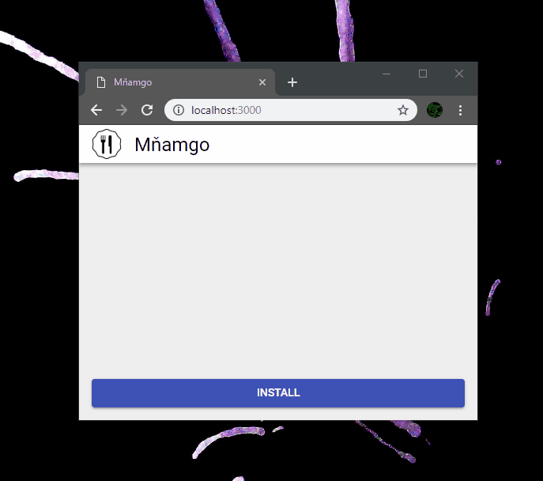

# PWA install handler

Handling PWA installation prompt made easier. [MDN docs](https://developer.mozilla.org/en-US/docs/Web/API/Window/onbeforeinstallprompt)

## Instalation

`npm install --save-dev pwa-install-handler`

## Usage

### HTML

```html
<button role="button" id="installButton" style="display: none;">
	Install
</button>
```

### JavaScript

```javascript
import pwaInstallHandler from 'pwa-install-handler'

const $button = document.querySelector('#installButton')

pwaInstallHandler.addListener((canInstall) => {
	$button.style.display = canInstall ? 'inline-block' : 'none'
})

$button.addEventListener('click', () => {
	pwaInstallHandler.install().then((isInstalled) => {
		console.log(
			isInstalled
				? 'User accepted installation prompt'
				: 'User rejected installation prompt'
		)
	})
})
```

### Screencast



## Methods

```typescript
pwaInstallHandler.install: () => Promise<boolean>
```

```typescript
pwaInstallHandler.addListener: (
	callback: (canInstall: boolean) => void,
	install?: () => Promise<boolean>
) => void
```

```typescript
pwaInstallHandler.removeListener: (
	callback: (canInstall: boolean) => void,
	install?: () => Promise<boolean>
) => void
```

```typescript
pwaInstallHandler.canInstall: () => boolean
```

```typescript
pwaInstallHandler.getEvent: () => BeforeInstallPromptEvent | null
```
